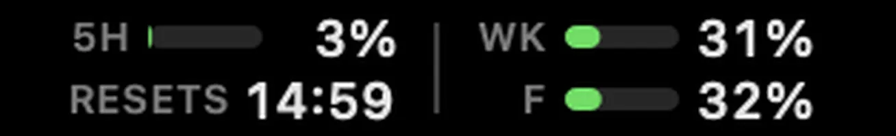

# Clusage — Claude usage in your macOS menu bar



A Stats-style macOS menu bar app showing your Claude Code usage as a compact
two-column grid of mini progress bars, authenticated by your claude.ai session
cookie — paste it once, no keychain access, no API key setup.

**Left column:** 5-hour session gauge · `RESETS` time for that window (12 or 24h, follows your system setting)  
**Right column:** `WK` weekly usage across all models · `F` Fable weekly usage  
**Codex column (only when Codex is installed):** `1D` / `7D` estimated Codex cost · `MO` monthly limit gauge · `RST` monthly reset date — see [Codex column](#codex-column)  
**Colors:** green <70% · yellow 70–89% · red ≥90%  
**Auto-refresh:** every 5 minutes by default (plus an immediate fetch on wake) — pick
1/2/3/5/8/13 minutes via **Refresh Every** in the dropdown; the choice persists in the
`com.mlg87.clusage-menubar` preferences domain under key `refresh_interval_minutes`.  
**Providers:** show either Claude or Codex or both via **Show in Menu Bar** (keys
`show_claude` / `codex_column_visible`) — see [Showing one provider or both](#showing-one-provider-or-both).

---

## Menu bar layouts

**Menu Bar Layout** in the dropdown switches between two layouts (persisted under
`menubar_style`):

- **Usage Grid** (default) — the layout above: percent *used* per limit, the 5h
  reset time in its own `RESETS` cell, Codex costs in the third column.
- **Remaining Capacity** — answers "how much room is left, and when do I get
  more?" at a glance:

  ```
  ✻  5h  ▰▱▱▱▱ 24% left · ↻19m   │  ✿  Mo  ▰▱▱▱▱ 21% left · ↻19d
     Wk  ▰▰▰▱▱ 56% left · ↻3d    │
  ```

  One block per provider, marked by an icon (✻ Claude, the OpenAI blossom for
  Codex). Every displayed limit is a segmented bar that *drains* as you use
  capacity, followed by `% left` and a `↻` countdown to its reset — exact
  dates/times stay in the dropdown. The model-specific weekly limit replaces the
  all-models week only when it is the tighter one (labelled `Wk(F)`). Codex shows
  the real monthly limit when ChatGPT reports one, otherwise your personal budget,
  labelled `Budget` so it can't be mistaken for a provider limit (past the budget
  it reads `$18 over`). Dollar estimates and secondary limits live in the dropdown.
  Colour signals attention rather than consumption: neutral bars, **amber** when
  ≤30% remains, **red** when ≤10% remains.

---

## Codex column

If the OpenAI Codex CLI (or Codex Desktop) is installed — i.e. `~/.codex/sessions`
or `~/.codex/archived_sessions` exists — Clusage adds a third column showing Codex
usage next to the Claude gauges:

```
5H  ▓▓░░ 42%  │  WK ▓░░░ 17%  │  1D $15.7    7D $29.7
RESETS 9:00 PM │  F  ▓▓▓░ 90%  │  MO ▓▓▓░ 84%  RST 8/31
```

- **`1D` / `7D`** — estimated Codex cost today and over the rolling last 7 days,
  parsed locally from `~/.codex/sessions/**/*.jsonl` (no network, no auth).
  Switch to raw token counts via **Codex Column → Token Counts**.
- **`MO`** — the month gauge. When your ChatGPT workspace has **spend controls**
  enabled, this is the real monthly credit limit fetched from
  `chatgpt.com/backend-api/wham/usage` (standard green/yellow/red limit bands) and
  `RST` shows the reset date. Auth is zero-setup: the Bearer token is read fresh
  from the Codex CLI's own `~/.codex/auth.json`, never logged, never sent anywhere
  but `chatgpt.com`; a stale token self-heals the next time you run `codex`.
- **`MO` fallback** — plans without spend controls report no limit at all, so the
  gauge instead frames month-to-date estimated cost against **Codex Column →
  Monthly Budget** (default $100/month): green at or under budget · yellow up to
  2× · red beyond 2×.

The dropdown gains a **Codex** section with full-precision numbers, the per-model
7-day breakdown, sessions active today, and any limit/spend-control flags OpenAI
reports.

### Showing one provider or both

**Show in Menu Bar** lists both providers with a checkmark each — uncheck either
to drop it from the menu bar and the dropdown. One must stay visible: the last
checked provider is drawn greyed out, so the rule is apparent instead of a click
that does nothing. With no Codex install detected both entries are greyed out,
since hiding Claude would leave a bar of dashes and the Codex entry promises a
column that can't appear. A hidden provider costs nothing — no claude.ai request
and no session-log scan — and is refreshed the moment you turn it back on.

### How Codex costs are estimated

Codex business/credit plans never expose 5h/weekly percent windows or a credit
balance to the client (`rate_limits.primary/secondary` and `credits.balance` are
null in every session log), so cost-from-tokens is the honest usage signal.
Each turn's `last_token_usage` (the per-turn delta) is priced at OpenAI's
**standard API tier** (`Sources/ClusageCore/CodexPricing.swift`, rates from
developers.openai.com/api/docs/pricing, checked 2026-09-11): uncached input at the
input rate, cached input at the cached rate, output at the output rate. Model
attribution comes from each session's `turn_context` lines (falling back to
`session_meta.base_instructions.provenance.model` for ambient Codex Desktop
sessions); unknown models use the mid-tier rate. Treat the numbers as
API-equivalent estimates, not a bill — credit-plan internal rates may differ.

The scanner covers a 32-day window and keeps a per-file `(mtime, size)` parse
cache in `~/Library/Application Support/Clusage/`, so only the first-ever scan
reads everything; every refresh after that re-reads just the files Codex is
actively appending to, and the cache is only rewritten when it actually changed.
Measured on an 814-file / 1.3 GB tree, a full parse of every in-window file takes
about 9 seconds.

Same gray-area disclaimer as the Claude endpoint: `wham/usage` is undocumented and
may change. Clusage degrades to the budget barometer when it's unavailable, and
the whole column disappears on Macs without Codex.

---

## Install

### Quick install (recommended)

```sh
curl -fsSL https://raw.githubusercontent.com/mlg87/lcj/main/clusage-menubar/install.sh | bash
```

Downloads the latest release, installs to `/Applications` (or `~/Applications`
for non-admin users), and launches it — **no Gatekeeper prompts**. WHY: macOS
only blocks apps carrying the `com.apple.quarantine` attribute, which browsers
set on downloads; `curl`/`tar` never set it, and the ad-hoc signature satisfies
Apple Silicon's signed-code requirement.

On first launch a dialog explains how to copy your session cookie from claude.ai
(Settings → Usage → DevTools → Network → `usage` request → `Cookie` request header).
Paste and Save; the usage bars appear within a few seconds.

### Download the DMG (manual)

1. Download `ClusageMenubar-X.Y.Z.dmg` from [Releases](../../releases).
2. Open the DMG, drag **ClusageMenubar** to Applications.
3. **Gatekeeper blocks the first launch** — releases are ad-hoc signed, not
   notarized (no Apple Developer Program). Either:
   - System Settings → Privacy & Security → scroll to the block message →
     **Open Anyway** (macOS 15 removed the right-click → Open bypass), or
   - `xattr -d com.apple.quarantine /Applications/ClusageMenubar.app`
4. Launch it and follow the cookie dialog as above.

### Build from source

Prerequisites: macOS 13+, Xcode Command Line Tools (`xcode-select --install`).

```sh
git clone https://github.com/mlg87/lcj.git
cd lcj/clusage-menubar
make dmg          # builds ClusageMenubar.app + ClusageMenubar-X.Y.Z.dmg
# or just:
make app          # builds build/ClusageMenubar.app (no DMG)
```

---

## How auth works

Clusage uses your **pasted claude.ai session cookie** — no Keychain access, no API key.

Resolution order:
1. **`CLUSAGE_COOKIE` environment variable** — overrides the stored value (tests/CI).
2. **UserDefaults** — stored in the `com.mlg87.clusage-menubar` preferences domain under
   key `session_cookie` after your first paste.

The cookie is stored **unencrypted** in the app's preferences plist — the same trust
level as the browser profile it was copied from. It is never logged and never sent
anywhere but `claude.ai`.

### Compliance / gray-area disclaimer

The usage data comes from `GET https://claude.ai/api/organizations/<orgId>/usage` — the
same internal API the claude.ai usage page calls. This is an **undocumented, internal
endpoint** and may change or disappear without notice. Clusage degrades gracefully
(shows "–" bars) whenever it becomes unavailable. Use is at your own discretion.

---

## Dev commands

```sh
make build    # swift build (debug)
make test     # swift run ClusageTests  (assertion-based; no XCTest needed)
make lint     # shellcheck all .sh scripts
make check    # build + test + lint
make app      # ./build.sh — release app bundle in build/
make dmg      # app + ./create_dmg.sh — DMG in clusage-menubar/
```

### Env vars

| Variable | Default | Purpose |
|---|---|---|
| `ARCHS` | `arm64 x86_64` | Architectures to build. Set to `arm64` if x86_64 CLT build fails. |
| `CODESIGN_IDENTITY` | `-` (ad-hoc) | `build.sh`: optional signing identity. Releases ship ad-hoc; only needed for local experiments with a real/self-signed cert. |
| `CLUSAGE_TARBALL` | *(unset)* | `install.sh`: path to a local `ClusageMenubar-*.tar.gz`; skips the download (script testing). |
| `SKIP_DMG_LAYOUT` | *(unset)* | Set to any value to skip the Finder AppleScript icon-layout step (used on headless CI). |
| `CLUSAGE_COOKIE` | *(unset)* | Overrides the stored session cookie at runtime (tests/CI). |
| `CLUSAGE_CODEX_HOME` | `~/.codex` | Codex home to scan (`sessions/`, `archived_sessions/`, `auth.json`); point at a fixture tree for tests. |
| `CLUSAGE_CHATGPT_TOKEN` | *(unset)* | Overrides the Bearer token read from `~/.codex/auth.json` for the monthly-limit fetch (tests/CI). |

---

## Release procedure

Releases are fully automated by [release-please](https://github.com/googleapis/release-please)
+ [`clusage-menubar-release.yml`](../.github/workflows/clusage-menubar-release.yml).
Never create `clusage-menubar-v*` tags/releases or edit `version.txt` by hand — CI owns them.

1. Merge PRs whose commits follow [Conventional Commits](https://www.conventionalcommits.org/)
   (`fix:` → patch, `feat:` → minor, `feat!:`/`BREAKING CHANGE:` → major) touching `clusage-menubar/**`.
2. release-please maintains a release PR ("chore(main): release clusage-menubar X.Y.Z")
   that accumulates merged changes, bumping `version.txt` and `CHANGELOG.md`.
3. Merge that release PR when you want to ship. CI tags `clusage-menubar-vX.Y.Z`, builds the
   ad-hoc-signed universal app, uploads `ClusageMenubar-X.Y.Z.dmg` and
   `ClusageMenubar-X.Y.Z.tar.gz` (consumed by `install.sh`), and publishes the release.

Release builds need **no signing secrets** — artifacts are ad-hoc signed. The
release stays a draft until both assets upload; if the job fails, fix and re-run it.
---

## Troubleshooting

**No session cookie set** — use **Set Session Cookie…** in the menu bar dropdown.
Follow the in-app instructions to copy the `Cookie` header from DevTools on
claude.ai/settings/usage and paste it into the dialog.

**Cookie rejected or expired** — your session has expired. Log in to claude.ai again,
then copy a fresh cookie via the same DevTools steps and paste it with
**Set Session Cookie…**.

**No Codex column** — the column only appears when `~/.codex/sessions` (or
`~/.codex/archived_sessions`) exists and **Show in Menu Bar → Codex** is checked.
Run `codex` once to create the directory. Without a Codex install both **Show in
Menu Bar** entries are greyed out, since there is nothing to switch between.

**`MO` shows dollars instead of a percent** — your ChatGPT plan reports no spend
control, so the gauge falls back to the monthly budget barometer. If your workspace
does have spend controls, make sure the Codex CLI is signed in (`~/.codex/auth.json`);
the dropdown's "Monthly limit:" row says which case you're in.

**Launch at Login doesn't work** — `SMAppService` requires the app to be in a stable
location (e.g. `/Applications`). It won't work when run via `swift run` or directly
from the build directory.
